UTP - Desarrollo en aplicaciones móviles
========================================

## Práctica calificada 1

### Guía de usuario

-   1.El usuario deberá registrarse antes de ingresar a la aplicación dando click en el boton SIGN UP.
    
    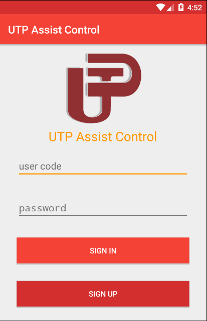
    
-   2.El usuario deberá registrar sus datos personales y luego presionar el boton REGISTER.
    
    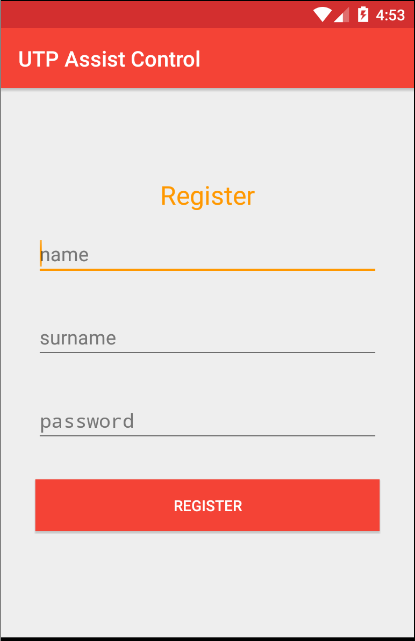
    
    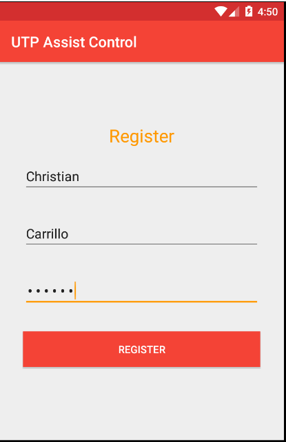
    
    3.El sistema asignará un código aleatorio al usuario registrado.
    
    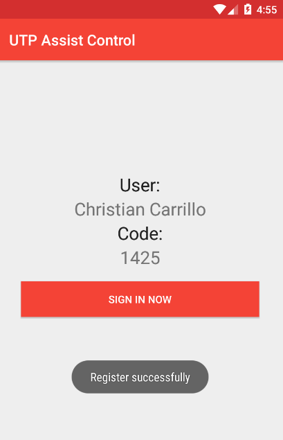
    
    4.Presionando el boton SIGN IN NOW el usuario volverá a la pantalla inicial, donde colocará su código y contraseña y presionará el boton SIGN IN para ingresar a la aplicación.
    
    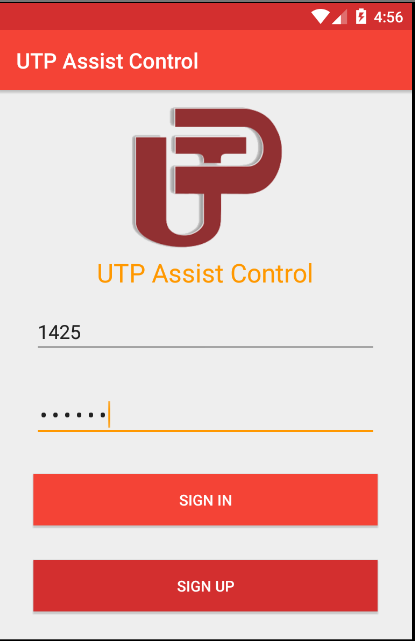
    
    5.Si las credenciales son correctas el usuario será redirigido a la pantalla de bienvenida.
    
    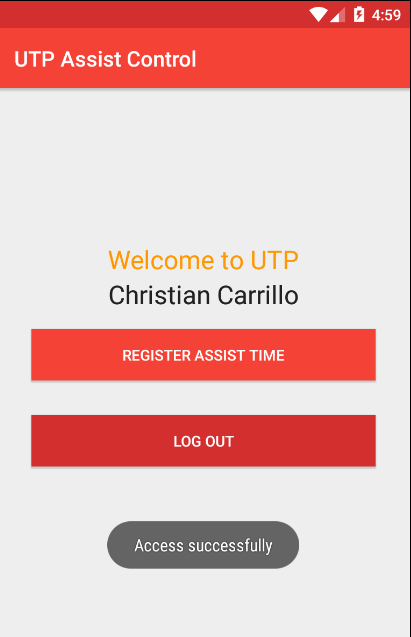
    
    6.Para registrar la asistencia el usuario presionará el boton REGISTER ASSIST TIME.
    
    7.El usuario será redirigido a una pantalla donde se notificará sus datos y la fecha de registro de asistencia.
    
    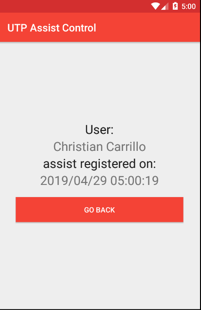
    
    8.El usuario presionará el boton GO BACK para volver a la pantalla de bienvenida.
    
    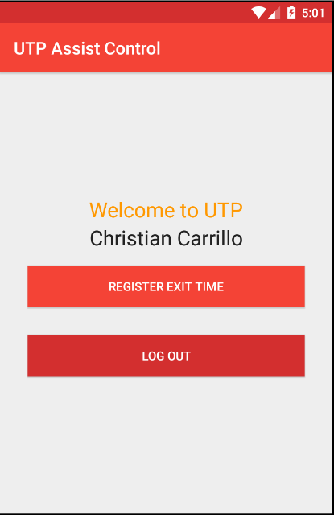
    
    9.Para registrar la salida el usuario presionará el boton REGISTER EXIT TIME.
    
    10.El usuario será redirigido a una pantalla donde se notificará sus datos y la fecha de regitro de salida.
        
    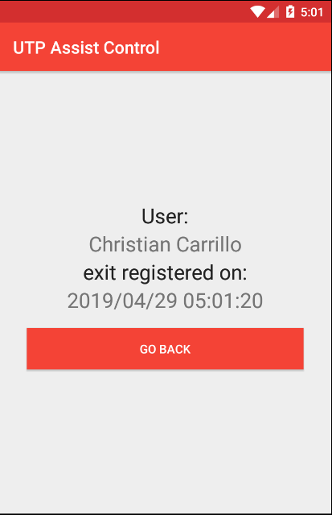
    
    11.El usuario presionará el boton GO BACK para volver a la pantalla de bienvenida.
    
    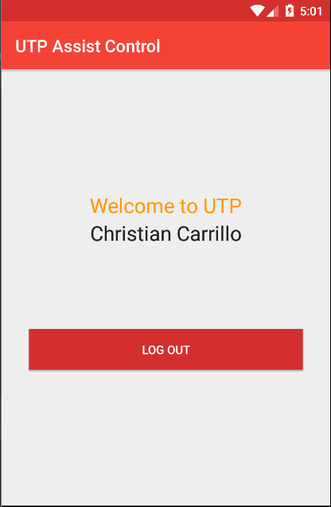
    
    12.Presionando el boton LOG OUT el usuario saldrá de la aplicación y volverá a la pantalla inicial.
    
    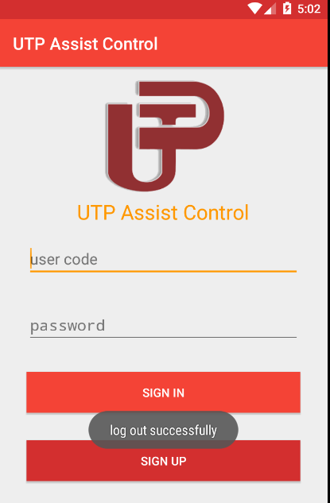
 